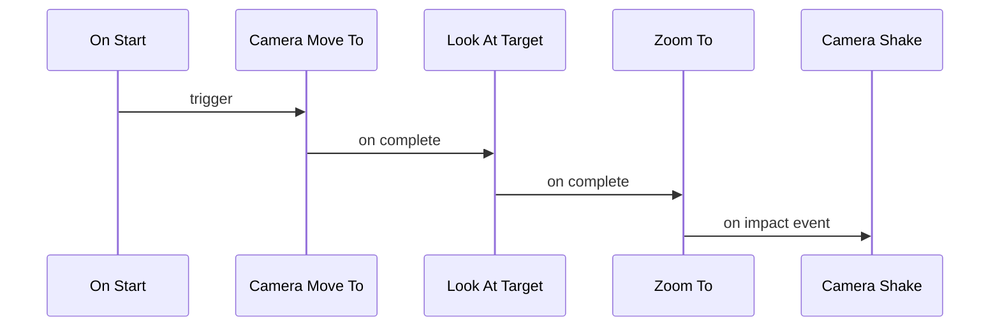

# Cutscene – Move, LookAt, Zoom, Impact Shake

## Steps
1. Move To (5s)
2. Look At (1s)
3. Zoom To (2s)
4. Camera Shake (0.4s on impact)

## Expected Result
- Cinematic intro then punchy shake on impact cue.

