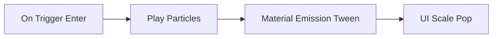

# Pickup Flow (Particles + Emission + UI Pop)

## Steps
1. Trigger: On Trigger Enter (player)
2. Particles: Play (2s)
3. Material: Emission 0→4 (1s)
4. UI: Scale 0.9→1.1→1.0 (0.3s)

## Expected Result
- Spark burst, item glows, UI pop feedback.

## Pitfalls
- Pool particle systems for repeated pickups.

