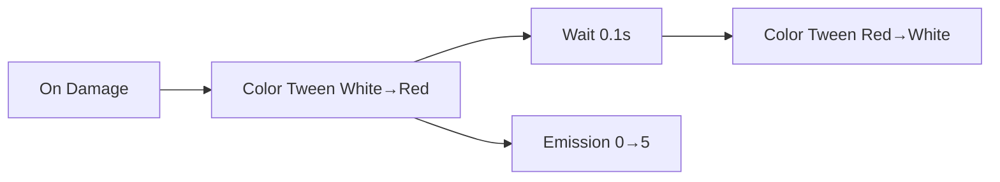

# Material Damage Flash + Glow

## Steps
1. Color to Red (0.2s)
2. Wait (0.1s)
3. Color back (1.0s)
4. Emission Tween (0→5 over 0.5s)

## Expected Result
- Quick red flash and glow pulse on damage.

## Pitfalls
- Clamp emission for mobile; verify shader property name.

