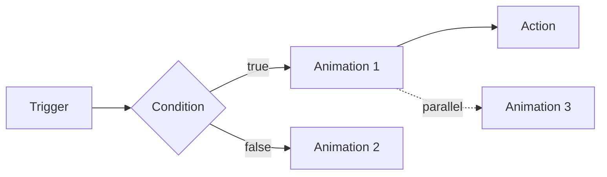

# Advanced Graph Techniques

## Parallel and Sequencing
- Use multiple outgoing connections for parallel execution.
- Use Delay nodes or per-node delays to align timings.
- Prefer short branches over deep chains for readability.

## Timing & Pacing
- Delay Before/After for quick offsets.
- Shared “Run With Previous” to overlap effects cleanly.

## Debugging Graphs
- Enable Debug Logging on `GraphExecutor` during development.
- Use node-level debug toggles to trace execution.
- Verify triggers fire; add temporary Log actions for checkpoints.

## Extending with Custom Nodes (Overview)
- Create a ScriptableObject node type with serializable fields.
- Provide editor UI for the Inspector (properties, previews).
- Keep allocations low and avoid reflection in hot paths.
- Expose safe defaults and validations.

## Example: Cinematic Chain
1. Trigger: On Start
2. Camera Move To → Look At → Zoom To
3. On impact event: Camera Shake + Play Sound (parallel)

Expected Result: Smooth intro motion; responsive impact.

